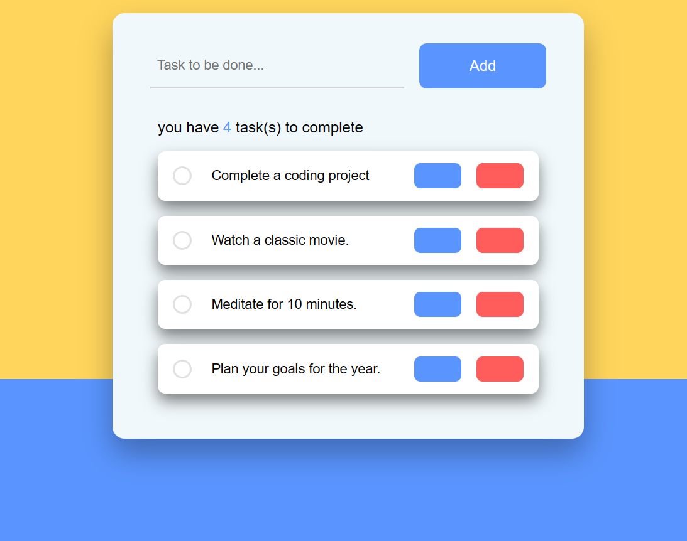

<!DOCTYPE html>
<html lang="en">
<head>
    <meta charset="UTF-8">
    <meta name="viewport" content="width=device-width, initial-scale=1.0">
    <title>To-Do-List README</title>
</head>
<body>
    <h1>To-Do-List</h1>
    
A simple To-Do List application built with HTML, CSS, and JavaScript.

    
    
    
    <h2>Features</h2>
    <ul>
        <li>Add tasks to your to-do list.</li>
        <li>Mark tasks as completed by checking them.</li>
        <li>Edit existing tasks.</li>
        <li>Delete tasks you no longer need.</li>
        <li>Responsive design for various screen sizes.</li>
    </ul>
    
    <h2>Built With</h2>
    <ul>
        <li>HTML</li>
        <li>CSS</li>
        <li>JavaScript</li>
    </ul>
    
    <h2>Libraries and Dependencies</h2>
    <ul>
        <li><a href="https://fontawesome.com/">Font Awesome</a>: Used for icons.</li>
    </ul>
    
</body>
</html>
